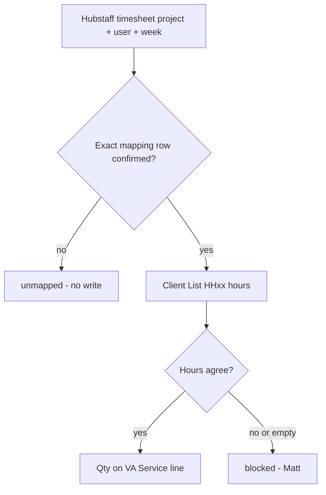

# Data model — uniformity and determinism

Updated 2026-08-27 9:30pm CT.

There is no separate database. This repo’s mapping is the join. Every surface must speak the same grain, the same keys, and the same fail-closed rules. Names are labels. IDs route. If a row cannot be keyed, it does not write.

## Grain

One billing row is **one VA assignment on one Hubstaff project for one week**.

```
(hubstaff_org_id, hubstaff_project_id, hubstaff_user_id, week_start)
```

That row maps to **one QBO Service line** on **one recurring sales receipt** for **one QBO customer** (the real client, not the VA).

Not a grain: Hubstaff client (those are people, e.g. Peter Sotos). Not a grain: Hubstaff project alone (one project can have many VAs). Not a grain: tracker sheet row number (moves).

## Who owns what

| Surface | Owns | Does not own |
|---|---|---|
| Hubstaff | Time. Project ID, user ID, org 730247 | Billing adjustments, QBO customers, pay |
| Celdy Client List | What should be billed that week (`HH0xx`), DBA vs legal, VA name / VA# | Live Hubstaff records, QBO writes |
| Matt Excel | What Matt actually types today. Must expose the same grain once we have the file | A second source of truth that disagrees with Client List |
| QBO | Customer, Service (VA), recurring sales receipt, Qty/hours, client bill rate on the Service | Hubstaff, tracker pay columns |
| This repo | Join table + routing rules | Invented IDs, fuzzy names |

Hubstaff is an **input**. Client List `HH0xx` is the **hours source of truth** once filled. QBO is the **output**. Matt Excel must equal Client List for a confirmed week; if it doesn’t, the row is `blocked`, not averaged.

## Keys (route on these, never on names)

| Entity | Canonical key | Display only |
|---|---|---|
| Org | `hubstaff_org_id` = `730247` | Helper Heroes |
| Client (legal) | `qbo_customer_id` once Matt fills it | `legal_business_name` |
| Location / DBA | `hubstaff_project_id` | `client_name`, `hubstaff_project_name` |
| VA person | `hubstaff_user_id` | `va_name`, `hubstaff_user_name` |
| VA# on that client | `va_number` (parsed) + project | text inside `va_name` |
| QBO Service | `qbo_item_id` | `qbo_service_name` (VA name on the receipt) |
| Receipt | `qbo_recurring_sales_receipt_id` | |
| Receipt line | `qbo_line_id` | |
| Revenue account | `qbo_revenue_account_id` | Chart of Accounts name |
| Week | `week_start` (Monday ISO date) | `HH061 (Aug 24-30)` |

**Routing key** (logs, dry-run, Codex):

```
hh:{org_id}:{project_id}:{user_id}:{week_start}
```

Example: `hh:730247:3889080:USERID:2026-08-17`

Until `hubstaff_user_id` is filled (read-only Hubstaff lookup, no live writes), a row cannot leave `draft`. Do not invent user IDs. Do not key on VA name.

## Naming convention

Create nothing in live Hubstaff. Names we **create** are QBO-only, and only on phantoms until Matt says go.

| What | Rule |
|---|---|
| QBO phantom anything | Prefix `HH MOCK `. Never a live name. |
| QBO customer | Legal business name. One customer per real client. Not per VA. |
| QBO Service (VA) | Tracker `va_name` as-is so it prints on the sales receipt. Uniqueness is `qbo_item_id` / `hubstaff_user_id`, not the string. |
| QBO income account (phantom) | `HH MOCK VA Services` |
| QBO income account (live) | Matt/Alexander pick. Do not invent. |
| Week column | `HHnnn (Mon DD-Mon DD)` on Client List only. Ignore Won/Leads `HH053`. |
| CSV files | snake_case headers matching `mapping/schema.json`. |
| Status | `draft` \| `confirmed` \| `blocked`. Only `confirmed` may propose a QBO write. |

Normalize for **compare**, not for keys: trim, collapse spaces, casefold. If two strings still disagree, they are different. No fuzzy, no nickname, no “close enough” (Assisting Hands IL vs Orland Park stays unmatched).

Reserved Hubstaff names that are **never** clients: `BREAK`, `Helper Heroes' Project`.

## Routing (deterministic)

Every week, for each Hubstaff timesheet total `(project_id, user_id, week)`:

1. Look up mapping row with **exact** `hubstaff_project_id` + `hubstaff_user_id`. No name match.
2. If no row, or `status != confirmed` → `unmapped`. No QBO write.
3. Read Client List `weekly_hours_value` for that `HH0xx` week (same VA assignment).
4. Hours to propose:
   - Tracker weekly filled and equals Hubstaff (after rounding rule) → use that number.
   - Tracker weekly filled and disagrees with Hubstaff → `blocked`. Human (Matt) picks. Do not average. Do not prefer Hubstaff.
   - Tracker weekly empty → `blocked` until Matt/Celdy fills it or explicitly confirms Hubstaff hours for that week.
   - Matt Excel disagrees with Client List → `blocked`.
5. Write target is **Qty on the existing VA Service line** of the recurring sales receipt (`qbo_hours_field` = `Qty`). Not a custom field. Not an invoice.
6. Rate on the Service is client bill rate Matt entered. Never HH PH, net pay, or Hubstaff `pay_rate`.
7. `qbo_target` stays `phantom` until `phantom_validated`.



## 1:1 checks (must all agree before a live write)

| Check | A | B |
|---|---|---|
| Client | Hubstaff `project_id` | QBO `customer_id` via mapping |
| VA | Hubstaff `user_id` | QBO `item_id` (Service) |
| Hours | Hubstaff week total | Tracker `HH0xx` | QBO Qty |
| Week | ISO `week_start` | Client List column header |

Matt Excel, when linked, is a fourth copy of hours. It must equal B. It does not get a vote against the tracker.

## Fail closed

- Missing mapping row
- `status != confirmed`
- Name-only match (no IDs)
- Empty or mismatched hours
- `pay_rate` / HH PH / net pay on a QBO payload
- Create invoice / send / ACH
- Live Hubstaff writes
- Merge QBO customers from this workflow
- `qbo_target=live` before phantom validated
- Ambiguous project (generic “Executive Home Care”, “Assisting Hands IL”)

Unmatched tracker rows stay in `mapping/from-tracker-unmatched.csv` with a note. No invented Hubstaff IDs.

## Draft vs confirmed

`draft` may have blank QBO IDs and blank `hubstaff_user_id`.  
`confirmed` requires: `hubstaff_org_id`, `hubstaff_project_id`, `hubstaff_user_id`, `qbo_customer_id`, `qbo_item_id`, `qbo_recurring_sales_receipt_id`, `qbo_hours_field=Qty`, `week_start` known.

Matt is the only one who moves a row to `confirmed`.

## Open (blocks determinism until filled)

- Matt Excel column map (file still not in the repo)
- `hubstaff_user_id` per VA (read-only Hubstaff, when Codex/Grok can list members)
- QBO IDs (phantom Mock B first)
- Rounding rule if hours are not integers
- Which live Chart of Accounts revenue account VA Services use

## Files

- `mapping/schema.json` — row shape
- `mapping/from-tracker.csv` — VA-level join (draft)
- `mapping/BLANK.csv` — project-level Hubstaff IDs
- `mapping/from-tracker-unmatched.csv` — leftovers, no invented IDs
- `workflow/hubstaff-qbo-hours-mvp.json` — runtime steps
